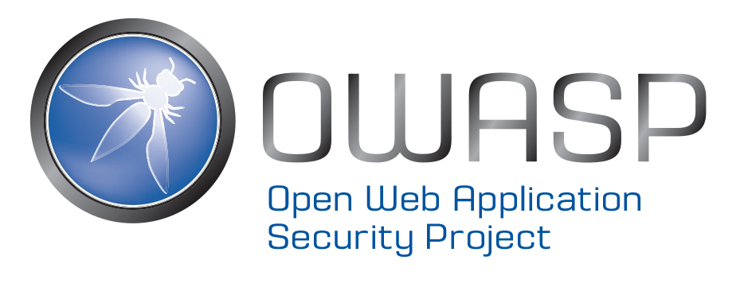

# {{page.title}}

OWASP is a nonprofit community organization with 200 chapters in over 100 countries around the world. Our mission is to make software security visible, so that individuals and organizations worldwide can make informed decisions about true software security risks. Our wiki has a wealth of security knowledge and we are well known for many of our influential security projects. The OWASP AppSec conferences represent our largest outreach efforts to advance our mission of spreading security knowledge. These events help fund the non-profit organization and provide a great learning experience for everyone involved. Many thanks to our conference sponsors, OWASP foundation sponsors, and most importantly the OWASP community!

