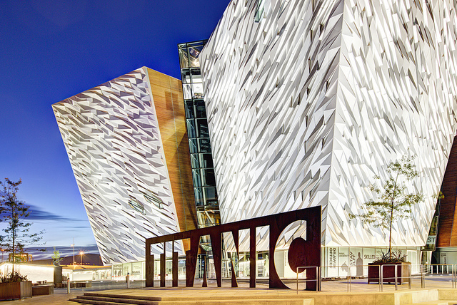
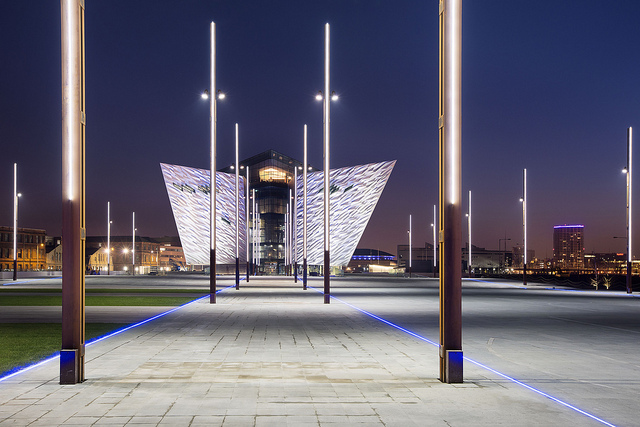

# {{page.title}}

The main conference dinner will be held in the beautiful Titanic Suite at the Titanic Center in Belfast, just a 5 minute walk away from the main conference venue. Titanic Belfast, an architecturally stunning venue in the heart of Belfast’s Titanic Quarter, recently voted the Europe’s Leading Tourist Attraction in 2016 (World Travel Awards).

Situated on the actual site where the Titanic was built, this center has many exhibits and tours showcasing how the Titanic was built 100 years ago. The main Titanic Suite features a staircase replica of the actual staircase on the famous ship. The opulent decor is themed on the interiors of Titanic herself, including a replica of the liners Grand Staircase and is an exclusive and opulent space.

Offering a uniquely Belfast experience, Titanic Belfast offers visitors panoramic views over the slipways, the exact site where the giant structure of Titanic was built over 100 years ago. On the first four floors, visitors can enjoy Titanic Belfast’s nine interactive galleries using state-of- the-art technology and innovative design to tell Titanic’s story from conception to construction and launch, to its maiden voyage and subsequent place in history.

The evening will start with a drinks reception can be held in the main foyer with space for up to 1000 to mingle. Guests will then move to the main suites where the best of Northern Irish foods will be provided in a buffet style.

The suites used for the dinner (Titanic Suite and Bridge) both overlook the Lagan River and the Game of Thrones studios where the famous TV program is filmed.