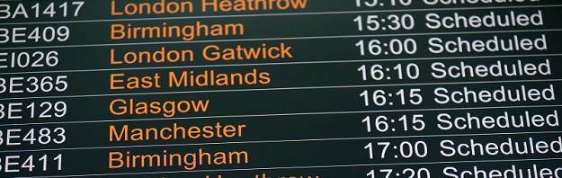
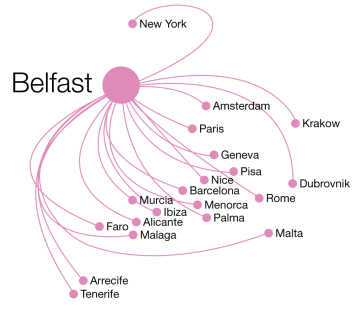

# {{page.title}}

Belfast city is wonderfully compact and travelling here couldn’t be easier with two major airports serving the city: George Best Belfast City Airport, located in the heart of the city and Belfast International Airport only 25 minutes away. Both airports offer a regular bus service that runs to and from the city centre.

Fly here in under an hour from 21 mainland UK airports including London which has over 179 flights a week. With 158 European and International routes servicing both Belfast and Dublin, the city is also easily accessible for European and international delegates.

The nearest train station is Central Station, which is in East Bridge Street, around five minutes’ walk from the venue. There is a regular train service to Dublin and the average journey time is around two hours. For train timetables, visit www.translink.co.uk.

The nearest bus station is the Laganside Bus Centre, which is around two minutes’ walk from Belfast Waterfront. There is a bus stop on Oxford Street, directly outside the building. The main bus provider in Belfast is Translink, which runs both Ulsterbus and Citybus Metro services.

The Waterfront Conference Center and Hilton Hotel are adjoined, allowing delegates to move from their rooms to the conference without needing to move outside. The Waterfront venue is 5 minutes’ walk from the main train station, and 10 minutes walks from the main bus station. All hotels listed for delegates are within a 10 minute walk from the venue.

## Arriving in Belfast International Airport (Aldergrove)
This airport is 17 miles outside of Belfast city center.  There are many options for travelling into Belfast.

* Taxi: There are dedicate phones in the Arrivals Hall, beside the main exit.  A journey into Belfast should cost around £15-£20.
* Bus: A bus service operates in front of the Terminal and goes directly to Belfast City Centre.   Journey time approximately 25 minutes.  In our experience, if there is more than one person travelling, the taxi fare will probably be equal to or less than multiple bus fares.  http://www.translink.co.uk/
* Car Hire: There are multiple vendors providing car hire services in the Arrivals Hall.
* Train: There are no train services from Aldergrove into Belfast.

## Arriving In Belfast City Airport (george Best Airport)
This is the closest airport to Belfast, only around 3 miles from the city center.  Again there are many options.

* Taxi: There is a taxi rank outside the arrivals hall, with a journey costing around £10.
* Bus: Bus services are frequent and travel directly to Belfast city.  These can be found in front of the Terminal. Journey time approximately 10 minutes.  http://www.translink.co.uk/
* Car Hire: There are multiple vendors providing car hire services in the Arrivals Hall.
* Train: There are no train services from Belfast City Airport into Belfast.
 
## Arriving In Dublin Airport
Dublin airport is situated to the north of Dublin, approx. 10 miles outside of Dublin.   Dublin airport is around 100 miles from Belfast.

* Taxi: This is not an advisable method of travel, as the journey would cost over £100.  However taxis are available outside the Arrivals Hall.
* Bus: Two services operating directly in front of the Terminals, every half hour.  You can buy your ticket with a credit card or in GBP Sterling or Euro on the bus.  Journey time to Belfast is around 2 hours 30 minutes.  http://www.aircoach.ie/
* Train: To use the train you will need to travel from Dublin airport to Connolly Train Station in Dublin city.  Busses to Connolly station are frequent and take around 30 minutes.  Costs are less than 10 euros per person.  Taxis can also provide transport to Connolly Station.  Once at Connolly Station, the journey time is approximately 2 hours.  Trains run approximately every 2-3 hours. http://www.irishrail.ie/

## Visas

Visas are not required for delegates traveling from the UK, Ireland or Europe. Belfast is situated in the UK and therefore any international delegates who require visas to travel to the UK should contact their local British Embassy for more information.

Please note, any international delegate arriving into Dublin airport and traveling to Belfast will be crossing the border from the Republic of Ireland into the UK, and this should be taken into account for any visa application.

If you require more information regarding a visa to attend or work in Belfast, please check the UK government visa website at [https://www.gov.uk/check-uk-visa](https://www.gov.uk/check-uk-visa).