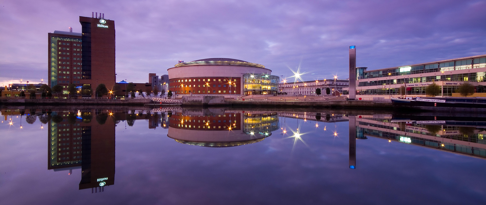

# {{page.title}}

AppSec Europe 2017 will be held in Belfast's premier venue, The Waterfront Hall, located in the bustling heart of Belfast city centre and close to all transport hubs and multiple car parks.

The Waterfront Hall has just completed a £29.5 million refurbishment and offers visitors a panoramic 360 degree view of Belfast, perched on the banks of the River Lagan, on which Belfast was originally founded.

The main hall is renowned for it's acoustics and comfortable setting.  The venue offers superb catering facilities, served by friendly, local staff.  

The Waterfront Hall is situated beside The Hilton Hotel, our main accommodation partner. 

[http://www.waterfront.co.uk/](http://www.waterfront.co.uk/)

