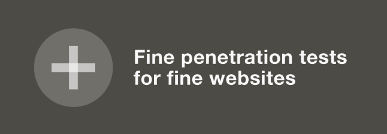
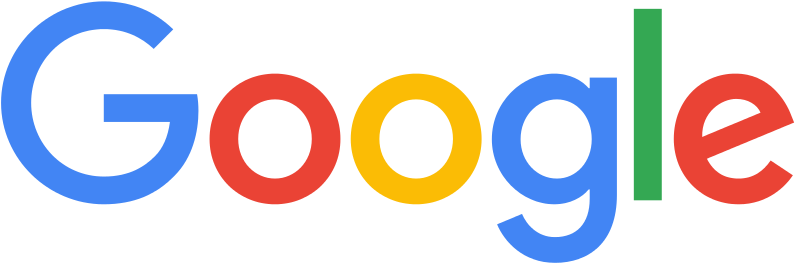
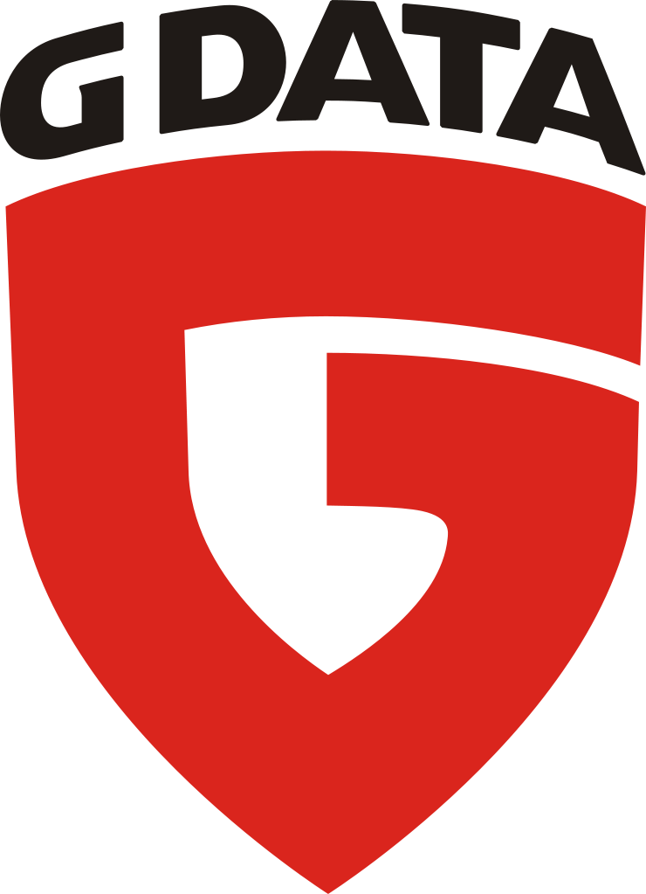

 
 
 

## Welcome again!

After our usual one year break, we are happy to bring back the awesomeness and present another edition of Allstars. This time taking place in the beautiful town of Belfast, alongside the OWASP AppSec EU 2017 conference. Allstars 2017 will happen on <strong>11th of May 2017</strong> and take an entire day from morning to evening.

## What is all this?

Allstars 2017 is delivering in one full day what's known to be the finest, hand-selected talks from prolific speakers and top-tier researchers in the field of information-security.

You can think of Allstars 2017 as a conference inside a conference - offering you one day with the most interesting influencers in today’s web application &amp; general IT (in-)security. Allstars 2017 is a dedicated invited-speakers track at the OWASP AppSec EU 2017 conference.

Allstars 2017 itself <strong>is free</strong>. You only need to have a ticket for the OWASP conference to get in.

We recommend all attendees to have a really good breakfast on 11th. Don't "allstar" on an empty belly.

## Preliminary Allstars 17 Schedule

* Opening Note, Mario Heiderich
* Nicolas Grégoire, "Nearly generic fuzzing of XML-based formats"
* Michele Orrú, "Phishing your way through Two-Factor Authentication"
* Hasherezade, "Wicked malware persistence methods"
* Thomas Roth, TBD
* Astera Schneeweisz, "Building security teams"
* Gareth Heyes, "DOM based Angular sandbox escapes"
* Filedescrptor, TBD
* Closing Note, Mario Heiderich

## Important dates  

* **Allstars 2017 Speaker Dinner (invite-only):** May 10th 2017 
* **Allstars 2017 Conference Day:** May 11th 2017
* **Allstars 2017 Party (invite-only):** May 12th 2017 

## Speakers 
 
* **Gareth Heyes** [@garethheyes](https://twitter.com/garethheyes)
* **Hasherezade** [@hasherezade](https://twitter.com/hasherezade)
* **Filedescriptor** [@filedescriptor](https://twitter.com/filedescriptor)
* **Michele Orrú** [@antisnatchor](https://twitter.com/antisnatchor)
* **Astera Schneeweisz** [@astera](https://twitter.com/astera)
* **Alex Inführ** [@insertScript](https://twitter.com/insertScript)
* **Thomas Roth** [@stacksmashing](https://twitter.com/stacksmashing)
* **Nicolas Grégoire** [@agarri_fr](https://twitter.com/agarri_fr)

## Our Sponsors

Without them, this event wouldn't be possible - thank you sponsors for making it happen! Keep in mind, Allstars 2017 is completely independent from OWASP's conference funding.

  

 
