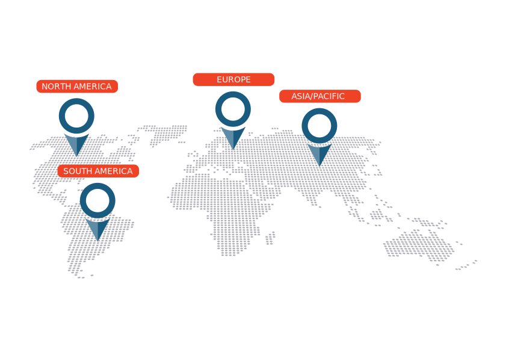

# {{page.title}}

## Why you should sponsor the AppSec EU 2017 in Belfast?

**OWASP’s Global AppSec Conferences are its flagship outreach effort.  Each year OWASP hosts four global AppSec conferences:**

With 45,000 OWASP participants globally, AppSec EU is the must-attend Application Security event in Europe for 2017. Building on the success of AppSecEU 2016 held in Rome, AppSecEU 2017 will be held in the heart of Belfast, the bustling capital city of Northern Ireland.

AppSecEU 2017 will have a special focus on engaging with businesses locally and from across the UK and Ireland, driven through business partnerships. The conference will be hosting a pre-conference drinks for delegates and non-delegates, businesses, government and technology thought-leaders which will offer sponsors a unique opportunity to interact at a personal level.

### Who attends AppSec EU 2017?

OWASP has a strong open and global community with more than 45.000 participants, more than65 organisational supporters and over 60 academic supporters via 200 local chapters across 6 continents in 117 countries.

The conference is expected to draw over 800 attendees from the UK/Ireland and across Europe and Internationally. Delegates represent companies from all with budgets dedicated to web application security initiatives including Financial Services, Media, Pharmaceuticals, Government, Healthcare, Technology, and many other verticals will be represented. Sponsorship opportunities are filling up rapidly.

OWASP Appsec Europe 2017 provides sponsors with exclusive access to its audience through a limited number of exhibit spaces.

<q>How can I sponsor the AppSec EU 2017?</q>

### OWASP offers a variety of opportunities for advertising and logo placement at their AppSec conferences:

* The conference hosts a sponsor hall where vendors can place stalls and engage with delegates and business. The sponsor hall opens on the Wednesday night for the pre-conference drinks reception, continuing through the main conference on Thursday and Friday.
* Advertising banners, both internal and external to the venue, are available to display your brand and support of OWASP. External advertisements are erected throughout the entire week of the conference.
* The conference has many social events and activities where a sponsor can engage with businesses and delegates.

Any proceeds from sponsorship support the mission of the OWASP Foundation (501c3 Not-For-Profit), driving funding for conferences, research grants, tools and documents, local chapters, and more.

Read our **[sponsorship flyer](assets/docs/AppSec_belfast_sponsorship.pdf)** with all the detailed information about the sponsorship levels, items and prices.

**Contact us today for more information:**

* [Gary Robinson](mailto:gary.robinson@owasp.org) (OWASP Belfast)
* [Kelly Santalucia](mailto:kelly.santalucia@owasp.org) (OWASP Global Membership and Business Liaison)
